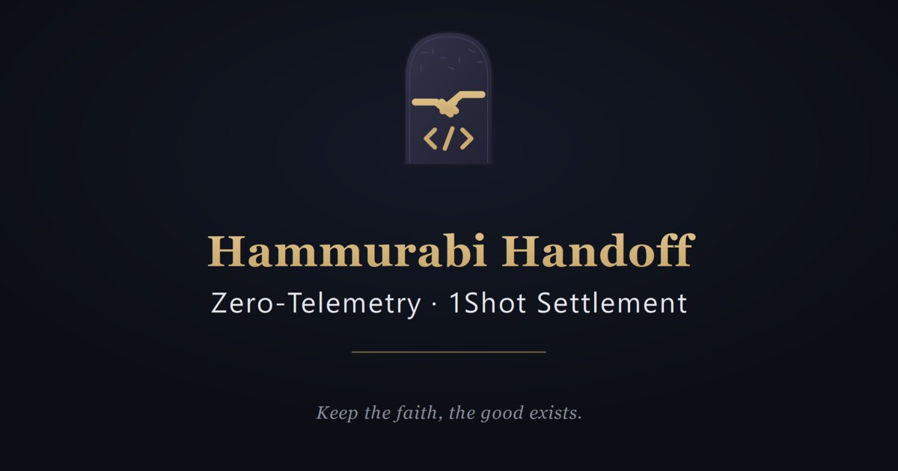

# Hammurabi Handoff

[](https://github.com/Hammurabi-Ramji/hammurabi-handoff/actions/workflows/handoff-ci.yml)
[](LICENSE)

**An OKX.AI Agent Service Provider (ASP) — OKX.AI Genesis Hackathon submission.**

**Credentials that die after one use. Agents you can actually read.**



A local-first, zero-telemetry ASP: AI agents announce intents in a
human-readable feed, an x402 payment gate meters every privileged action, and
a JIT vault mints ephemeral, payload-bound Ed25519 credentials with a strict
60-second TTL — then formats the signed intent for gasless settlement. Every
credential dies after one use; every action is metered; every step is a line
in a feed you can actually read.

**→ Full documentation lives in [`desktop/hammurabi-handoff/README.md`](desktop/hammurabi-handoff/README.md)** —
architecture, the complete HTTP flow, the ASP capability manifest, and the
full roadmap. This file is a map, not a duplicate.

## Try it in one command

```bash
cargo run -p hammurabi-handoff --features tauri-app
```

No npm step to run it — the desktop shell is a Svelte 5 app whose built
static bundle ships in-repo (`ui/dist`); npm is only needed to regenerate it
after editing `ui/src`. Tests: `cargo test --workspace` → 29 handoff · 38
crypto · 7 oka (74 total, all green, CI-gated on every push).

## Repository layout

This repo *is* the OKX ASP submission — it's not a slice of a larger
monorepo.

| Path | What's there |
|------|--------------|
| [`desktop/hammurabi-handoff/`](desktop/hammurabi-handoff/) | The ASP itself: Tauri shell, x402 gate, JIT vault, settlement formatting, the OKX marketplace bridge, and all submission docs (architecture, demo script, pitch deck, submission ledger) |
| [`core/iedb-crypto/`](core/iedb-crypto/) | The crypto pillar: Ed25519 identity, RFC 8785 canonical-JSON signing, BLAKE3 digests — what the vault mints credentials with |
| [`tooling/iedb-oka/`](tooling/iedb-oka/) | The OKX marketplace interop layer: typed ASP manifest modeling + the request/response translation between OKX's vocabulary and the Handoff pipeline's |

## Where to look for what

- **The pitch, problem, and solution** → [`desktop/hammurabi-handoff/README.md`](desktop/hammurabi-handoff/README.md)
- **System architecture + data flow** → [`docs/ARCHITECTURE.md`](desktop/hammurabi-handoff/docs/ARCHITECTURE.md)
- **90-second demo script** → [`docs/DEMO_SCRIPT.md`](desktop/hammurabi-handoff/docs/DEMO_SCRIPT.md)
- **Screenshots + demo video** → in the full README's Screenshots / Demo video sections
- **The ASP manifest OKX actually reads** → [`asp/manifest.json`](desktop/hammurabi-handoff/asp/manifest.json)
- **What's real vs. staged/mocked, and why** → [`docs/SUBMISSION_LEDGER.md`](desktop/hammurabi-handoff/docs/SUBMISSION_LEDGER.md) — every claim in this submission is checked against the shipped code there, not just asserted
- **Single source of truth for recurring numbers** (TTL, fee, test counts, roadmap gate legend) → [`docs/PROJECT_FACTS.md`](desktop/hammurabi-handoff/docs/PROJECT_FACTS.md)

## License

MIT — see [`LICENSE`](LICENSE).
